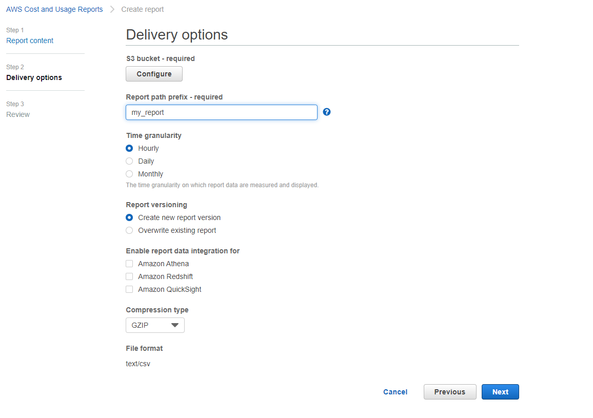

# AWS CUR reports extractor

This extractor downloads AWS CUR reports exported to S3 in CSV format. 

**Table of contents:**  
  
[TOC]

# AWS Setup

First, the CUR report exports need to be set up in the AWS account to be exported to S3 bucket 
in the selected granularity and CSV format. Follow this [guide](https://docs.aws.amazon.com/cur/latest/userguide/cur-create.html)
 to set up the export.
 
 Export Setup:
 
 - Setup S3 bucket
 - Set the report prefix
 - Select granularity
 - Select report versioning (overwrite recommended)
 - Choose GZIP compression type
 
 
 

# Functionality notes

The extractor downloads the latest complete CUR report pushed to the S3. It handles changing report schema 
by expanding the existing column set, if some column is removed it will contain NULL/Empty values.

# Configuration

## AWS config

Your S3 bucket details and credentials as set up in the AWS console

## New files only

If set to true, only newly generated report is downloaded each execution.

## Minimum date since

Minimum date of the report. Lowest report date to download. When **New files** only option is checked, 
this applies only to the first run, reset the state to backfill. Date in YYYY-MM-DD format 
or a string i.e. 5 days ago, 1 month ago, yesterday, etc. If left empty, all records are downloaded.

## Maximum date

Maximum date of the report. Max report date to download. When **New files** only option is checked, 
this applies only to the first run, reset the state to backfill. Date in YYYY-MM-DD format 
or a string i.e. 5 days ago, 1 month ago, yesterday, etc. If left empty, all records are downloaded.

## Report prefix

The prefix as you set up in the AWS CUR config. 
In S3 bucket this is path to your report. E.g. my-report or some/long/prefix/my_report

In most cases this would be the prefix you've chosen. If unsure, refer to the S3 bucket containing the report
 and copy the path of the report folder.

# Output

The output schema is described [here](https://docs.aws.amazon.com/cur/latest/userguide/data-dictionary.html)


**IMPORTANT NOTE** The result column names are modified to match the KBC Storage column name requirements:

- Categories are separated by `__`. e.g.`bill/BillingPeriodEndDate` is converted to `bill__billingPeriodEndDate`
- Any characters that are not alphanumeric or `_` underscores are replaced by underscore. 
E.g. `resourceTags/user:owner` is converted to `resourceTags__user_owner`
- The KBC Storage is case insesitive so the above may lead to duplicate names. In such case the names are deduplicated by adding an index. 
e.g `resourceTags/user:name` and `resourceTags/user:Name` lead to `resourceTags__user_Name` and `resourcetags__user_name1` 
columns respectively

**Note** That the output schema changes often and may be also affected by the tags and custom columns you define.


# Development

If required, change local data folder (the `CUSTOM_FOLDER` placeholder) path to your custom path in the docker-compose file:

```yaml
    volumes:
      - ./:/code
      - ./CUSTOM_FOLDER:/data
```

Clone this repository, init the workspace and run the component with following command:

```
git clone repo_path my-new-component
cd my-new-component
docker-compose build
docker-compose run --rm dev
```

Run the test suite and lint check using this command:

```
docker-compose run --rm test
```

# Integration

For information about deployment and integration with KBC, please refer to the [deployment section of developers documentation](https://developers.keboola.com/extend/component/deployment/) 